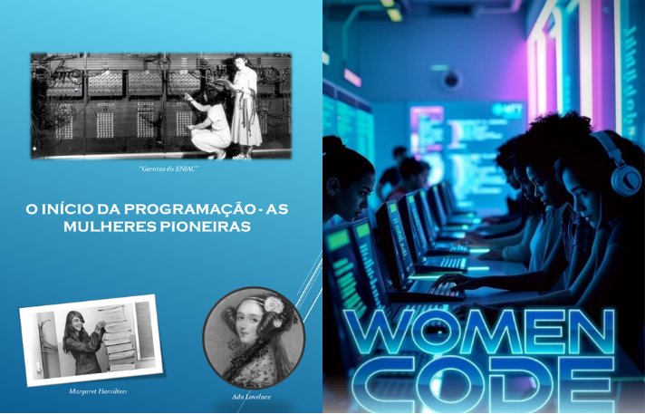

  

  

Meu Projeto: Ebook Gerado por I.A.
ℹ️ NOTA: Este é o repositório do meu projeto de ebook, desenvolvido como aluna durante o curso na plataforma da DIO.

Este projeto tem como objetivo criar um ebook digital utilizando ferramentas de IA. O tema central é Mulheres na Tecnologia, com foco na história e liderança feminina na computação e programação. Todos os prompts e recursos utilizados estão detalhados abaixo.

<a href="https://github.com/seu-usuario/prompts-recipe-to-create-a-ebook/blob/main/output/ebook%20-%20mulheres-na-tecnologia.pdf" title="View PDF now"> 📕 Clique aqui para ler o ebook</a>

💻 Tecnologias Utilizadas
DeepSeek - Para geração de conteúdo.

Leonardo AI - Para criação de imagens.

PowerPoint - Para diagramação e formatação.

🧠 Prompts Utilizados
DeepSeek
Ação	Prompt
Título	Crie um título de um ebook sobre o tema de Mulheres na Tecnologia, com um nicho de programação e subnicho de tecnologia. O título deve ser épico e curto, com uma temática de liderança. Liste 5 variações de títulos.
Conteúdo	Faça um texto para ebook, com foco no tema Codificando o Futuro: Elas Dominam a Programação, abordando a história das mulheres no início da computação/programação e o assunto em geral, citando mulheres históricas e de liderança.
Leonardo AI
Ação	Prompt
Imagem	A futuristic tech workspace with women of diverse racial backgrounds, all intensely focused on programming. One woman is Asian, another Black, and a third is Caucasian, sitting at modern desks surrounded by glowing neon lights, large holographic screens displaying lines of code and data. The environment has a nerdy, sci-fi aesthetic, with elements like circuit patterns, glowing coding languages, and digital graphics floating in the air. Each woman is wearing casual, comfortable clothing, with some geeky accessories like tech-related jewelry or t-shirts featuring coding jokes. The atmosphere is empowering and dynamic, showcasing women excelling in the field of programming. The title 'Women Code' is displayed at the top of the cover in bold, sleek, futuristic typography.
✨ Destaques
Conteúdo gerado via DeepSeek.

Imagens criadas com Leonardo AI.

Diagramação e formatação feitas por mim no PowerPoint.

📚 Materiais
Imagens utilizadas estão na pasta assets.

Ebook finalizado está na pasta output.

